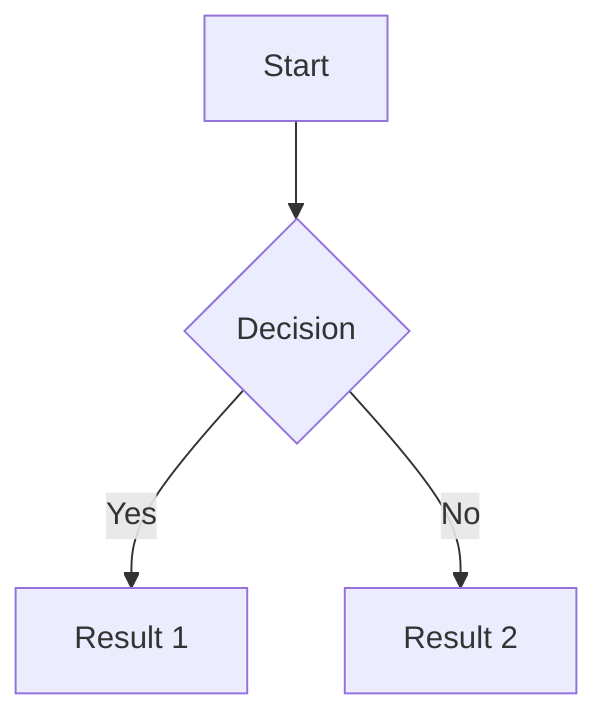

# Obsidian Markdown cheat-sheet

## Formatage de base

**Gras** → `**texte**` ou `__texte__`  
_Italique_ → `*texte*` ou `_texte_`  
_**Gras et italique**_ → `***texte***`  
~~Barré~~ → `~~texte~~`  
==Surligné== → `==texte==` (spécifique Obsidian)  
`Code inline` → `` `code` ``

## Titres

```markdown

# Titre 1
## Titre 2
### Titre 3
#### Titre 4
##### Titre 5
###### Titre 6
```

## Listes

**Liste à puces**

```markdown
- Item 1
- Item 2
  - Sous-item 2.1
  - Sous-item 2.2
- Item 3
```

**Liste numérotée**

```markdown
1. Premier
2. Deuxième
3. Troisième
```

**Liste de tâches**

```markdown
- [ ] Tâche non faite
- [x] Tâche complétée
```

## Liens

**Liens internes (Wiki)**

```markdown
[[Nom de la note]]
[[Nom de la note|Texte affiché]]
[[Nom de la note#Section]]
[[Nom de la note#^block-id]]
```

**Liens externes**

```markdown
[Texte du lien](https://example.com)
<https://example.com>
```

**Liens vers fichiers**

```markdown
![[image.png]]
![[document.pdf]]
![[audio.mp3]]
```

## Images

```markdown
![[image.png]]
![[image.png|200]]  (avec largeur)

```

## Citations

```markdown
> Ceci est une citation
> Sur plusieurs lignes
```

## Code

**Bloc de code**

````markdown
```python
def hello():
    print("Hello World")
```
````

**Code inline**

```markdown
Utilise la fonction `print()` pour afficher
```

## Tableaux

```markdown
| Colonne 1 | Colonne 2 | Colonne 3 |
| --------- | --------- | --------- |
| Ligne 1   | Donnée    | Donnée    |
| Ligne 2   | Donnée    | Donnée    |
```

**Alignement**

```markdown
| Gauche | Centre | Droite |
| :----- | :----: | -----: |
| A      | B      | C      |
```

## Séparateurs

```markdown
---
***
___
```

## Callouts (spécifique Obsidian)

```markdown
> [!note] Titre de la note
> Contenu de la callout

> [!info] Information
> Contenu

> [!tip] Astuce
> Contenu

> [!warning] Attention
> Contenu

> [!danger] Danger
> Contenu

> [!example] Exemple
> Contenu

> [!quote] Citation
> Contenu
```

**Callout repliable**

```markdown
> [!note]- Titre (replié par défaut)
> Contenu

> [!note]+ Titre (ouvert par défaut)
> Contenu
```

## Formules mathématiques (LaTeX)

**Inline**

```markdown
$E = mc^2$
```

**Bloc**

```markdown
$$
\begin{align}
x &= 2 + 3 \\
y &= 5
\end{align}
$$
```

## Notes de bas de page

```markdown
Voici un texte avec une note[^1]

[^1]: Ceci est la note de bas de page
```

## Échappement de caractères

```markdown
\*pas en italique\*
\[pas un lien\]
\# pas un titre
```

Caractères à échapper : `\` * _ {} [] () # + - . ! | `

## Commentaires

```markdown
%% Ceci est un commentaire invisible dans la vue lecture %%
```

## Frontmatter (métadonnées)

```yaml
---
title: Titre de la note
tags: [tag1, tag2, tag3]
aliases: [alias1, alias2]
date: 2025-11-25
---
```

## Diagrammes (avec Mermaid)

````markdown

````

## Raccourcis clavier utiles

|Action|Windows/Linux|Mac|
|---|---|---|
|Gras|`Ctrl + B`|`Cmd + B`|
|Italique|`Ctrl + I`|`Cmd + I`|
|Lien interne|`[[`|`[[`|
|Lien externe|`Ctrl + K`|`Cmd + K`|
|Chercher|`Ctrl + F`|`Cmd + F`|
|Palette de commandes|`Ctrl + P`|`Cmd + P`|
|Vue lecture/édition|`Ctrl + E`|`Cmd + E`|

## Blocs de référence

**Créer un bloc identifiable**

```markdown
Ceci est un paragraphe important ^mon-bloc-id
```

**Référencer le bloc**

```markdown
[[Note#^mon-bloc-id]]
```

## Embedding (intégrer du contenu)

```markdown
![[Autre note]]  (intègre toute la note)
![[Autre note#Section]]  (intègre une section)
![[Autre note#^block-id]]  (intègre un bloc)
```

## Tags

```markdown
#tag
#tag/sous-tag
#tag-avec-tiret
```

## Astuces spécifiques Obsidian

**Lien vers un fichier sans l'afficher**

```markdown
[](fichier.pdf)
```

**Redimensionner une image**

```markdown
![[image.png|100x100]]
![[image.png|100]]  (largeur seulement)
```

**Lien vers une ligne spécifique de code**

```markdown
[[fichier.md#^line-123]]
```

---

_Dernière mise à jour : 2025-11-25_

